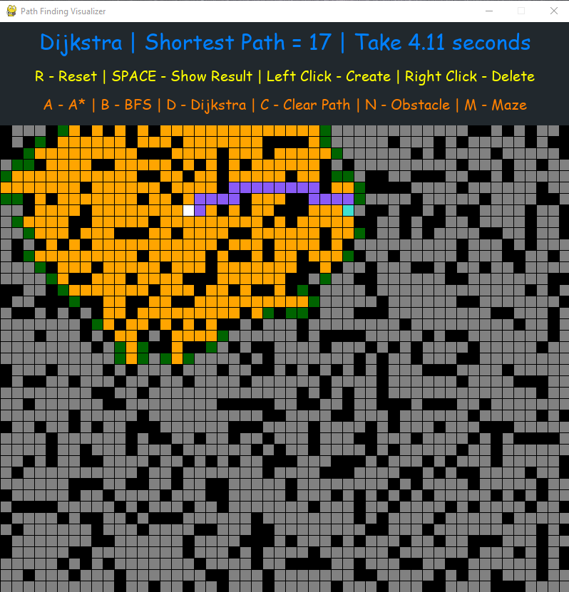
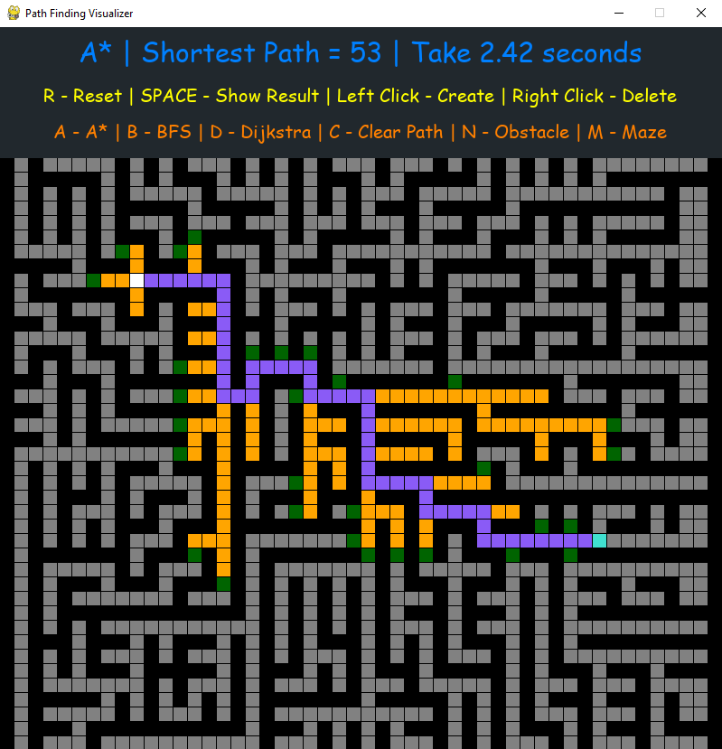

# Path Algorithm

This prgram show the shortest path between two point  
**Instruction:**

<!-- <pre> -->
1.  <kbd>left click</kbd> to create two points to find the shortest path (2 times)
2.  <kbd>drag left click</kbd> to draw a obsticle line
3.  <kbd>right click</kbd> to erase those two points or point from line (click/drag)
4.  <kbd>space bar</kbd> to show result
5.  <kbd>c</kbd> to clear path
6.  <kbd>r</kbd> to restart
7.  <kbd>n</kbd> to generate random obstacles
8.  <kbd>m</kbd> to generate maze
9.  <kbd>a</kbd> to use A* Algorithm
10. <kbd>b</kbd> to use BFS Algorithm
11. <kbd>d</kbd> to use Dijkstra Algorithm
<!-- </pre> -->

**Usage:**

```sh
>> py Path.py
```

<p align="left">
    
    
</p>

# Sort Algorithm


# Resource

- [tech with tim sorting algorithm](https://www.youtube.com/watch?v=twRidO-_vqQ)
- [tech with tim path finding algorithm](https://www.youtube.com/watch?v=JtiK0DOeI4A)
- [Python maze search](https://github.com/marblexu/PythonMazeSearch)