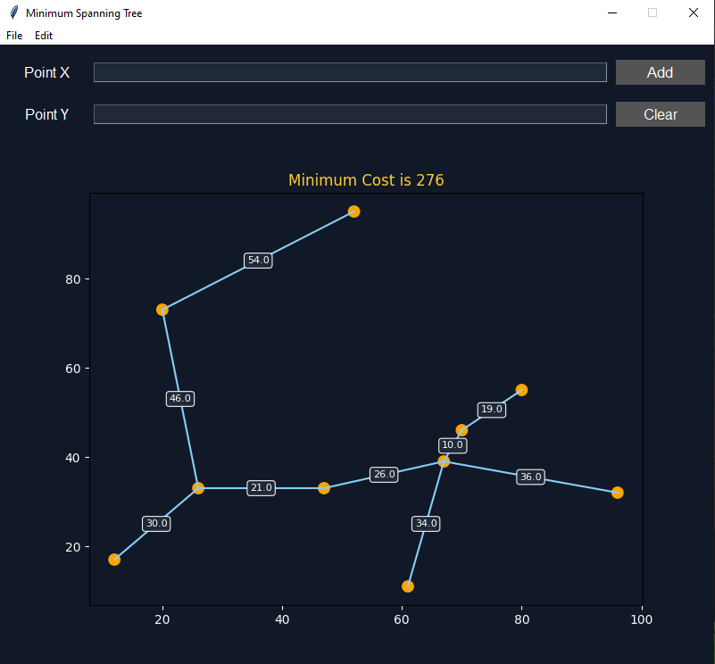

# Path Finding Algorithm

This program shows the shortest path between two point  
**Instruction:**

1.  <kbd>left click</kbd> to create two points to find the shortest path (2 times)
2.  <kbd>drag left click</kbd> to draw a obsticle line
3.  <kbd>right click</kbd> to erase those two points or point from line (click/drag)
4.  <kbd>space bar</kbd> to show result
5.  <kbd>c</kbd> to clear path
6.  <kbd>r</kbd> to restart
7.  <kbd>n</kbd> to generate random obstacles
8.  <kbd>m</kbd> to generate maze
9.  <kbd>a</kbd> to use __A*__ Algorithm
10. <kbd>b</kbd> to use __BFS__ Algorithm
11. <kbd>d</kbd> to use __Dijkstra__ Algorithm

**Usage:**

```sh
>> py Path.py
```

<p align="left">
    
    
</p>


# Roomba Path Finding

This program shows the shortest path between two point in the map  
Using a `Image_Grid.py` to create grid from `map.png`  

<p align="left">
    
</p>


**Instruction:**

<kbd>left click</kbd> to select a position and perform a shortest path

**Usage:**

```sh
>> py Roomba.py
```

<p align="left">
    
</p>


# Sort Algorithm

This program compares the sorting algorithms  
**Instruction:**

1. <kbd>Space Bar</kbd> to show result
1. <kbd>R</kbd> to reset
1. <kbd>A</kbd> to set to ascending order
1. <kbd>D</kbd> to set to descending order
1. <kbd>I</kbd> to use __Insertion__ Sort Algorithm
1. <kbd>B</kbd> to use __Bubble__ Sort Algorithm
1. <kbd>S</kbd> to use __Selection__ Sort Algorithm
1. <kbd>E</kbd> to use __Shell__ Sort Algorithm
1. <kbd>H</kbd> to use __Heap__ Sort Algorithm
1. <kbd>M</kbd> to use __Merge__ Sort Algorithm
1. <kbd>Q</kbd> to use __Quick__ Sort Algorithm

**Usage:**

```sh
>> py Sort.py
```

<p align="left">
    
    
</p>


# Sudoku

This program generates sudoku board and its solution  
Use `Sudoku_Solver.py` in `utils` to solve [online sudoku](https://sudoku.com/) automatically  

__Note:__ You have 5 seconds to move your cursor to **Top Left** corner of the board  

**Usage:**

```sh
>> cd utils
>> py Sudoku_Solver.py
```

<p align="left">
    
    
</p>

To use GUI, please follow the instruction below:

**Instruction:**  

1. <kbd>Click</kbd> to select the grid
2. <kbd>1-9</kbd> to sketch number and <kbd>Enter</kbd> to confirm
3. <kbd>Del</kbd> to delete sketch
4. <kbd>I</kbd> to view instruction
5. <kbd>C</kbd> to clear all sketch
6. <kbd>R</kbd> to reset board
7. <kbd>N</kbd> to create new game
8. <kbd>Space Bar</kbd> to show solution (sketch)
9. <kbd>&uarr;</kbd>, <kbd>&rarr;</kbd>, <kbd>&darr;</kbd>, <kbd>&larr;</kbd> to navigate through grid 

**Usage:**

```sh
>> py Sudoku.py
```

<p align="left">
    
    
</p>


# Tic Tac Toe

Minimax algorithm: backtracking decision making to find the optimal move  
**Instruction:**

1. <kbd>Click</kbd> grid to place your mark (__X/O__)
1. <kbd>g</kbd> to change gamemode (__pvp/ai__)
1. <kbd>0</kbd> to change ai level to 0 (__random algorithm__)
1. <kbd>1</kbd> to change ai level to 1 (__minimax algorithm__)
1. <kbd>r</kbd> to restart the game

**Usage:**

```sh
>> py XO.py
```

<p align="left">
    
    
</p>


# Container With Most Water

This program visualizes the `Container With Most Water` problem in LeetCode  
**Instruction:**

1. <kbd>Type</kbd> height array in Height Entry then <kbd>Add</kbd> to display
2. <kbd>New</kbd> to clear all of the canvas graph and title
3. <kbd>Save</kbd> to save plotted graph in `assets` folder
4. <kbd>Undo</kbd> to pop the last histogram
5. <kbd>Redo</kbd> to append the last popped histogram
6. <kbd>Annotate</kbd> to switch between on/off of histogram height visualize
6. <kbd>Water</kbd> to switch between on/off of water container visualize
7. <kbd>Random Histogram</kbd> to random generate (5-100) histogram's height
7. <kbd>Normal Distribution</kbd> to generate normal distribution with random mean and std

**Usage:**

```sh
>> py Container.py
```

<p align="left">
    
    
</p>


# Minimum Cost to Connect All Points

This program visualizes the `Minimum Cost to Connect All Points` problem in LeetCode  
**Instruction:**

1. <kbd>Type</kbd> x array in X Entry
2. <kbd>Type</kbd> y array in Y Entry
3. <kbd>Add</kbd> to display minimum spanning tree
2. <kbd>New</kbd> or <kbd>Clear</kbd> to clear all of the canvas graph and title
3. <kbd>Save</kbd> to save plotted graph in `assets` folder
4. <kbd>Undo</kbd> to pop the last x, y
5. <kbd>Redo</kbd> to append the last popped x, y
7. <kbd>Random MST</kbd> to random generate minimum spanning tree

**Usage:**

```sh
>> py MST.py
```

<p align="left">
    
    
</p>


# Regression

This program visualizes the `Regression` graph in form of `linear`, `non-linear`, and `logistic`  
**Instruction:**

1. <kbd>Type</kbd> x array in X Entry
2. <kbd>Type</kbd> y array in Y Entry
3. <kbd>Add</kbd> to display regression graph
4. <kbd>Save</kbd> to save graph in `assets` folder
5. <kbd>Clear</kbd> to clear all of the canvas graph and title
6. <kbd>Select</kbd> model to display in canvas graph and title

**Usage:**

```sh
>> py Regression.py
```

<p align="left">
    
    
</p>


# N-Puzzle

This program visualizes the `8-Puzzle` solved using A* Search,  
Use `N_Puzzle.ipynb` to animate the solution  
**Instruction:**

1. Create an animation that illustrates each steps in solution
2. Return `None` if there is no such solution
3. `0` represents empty slot that should be in top left corner
4. Plot each steps in subplots

**Example:**

```
Initial state of game:
+---+---+---+
| 1 | 6 | 0 |
+---+---+---+
| 7 | 2 | 4 |
+---+---+---+
| 8 | 5 | 3 |
+---+---+---+

Expected final state:
+---+---+---+
| 0 | 1 | 2 |
+---+---+---+
| 3 | 4 | 5 |
+---+---+---+
| 6 | 7 | 8 |
+---+---+---+
```

**Usage:**

```sh
>> py Puzzle.py
```

<p align="left">
    
</p>


# Resource

- [tech with tim sorting algorithm](https://www.youtube.com/watch?v=twRidO-_vqQ)
- [tech with tim path finding algorithm](https://www.youtube.com/watch?v=JtiK0DOeI4A)
- [Prim Algorithm](https://medium.com/swlh/fun-with-python-1-maze-generator-931639b4fb7e)
- [Python maze search](https://github.com/marblexu/PythonMazeSearch)
- [Path Finding](https://github.com/brean/python-pathfinding)
- [Roomba Path Finding](https://github.com/clear-code-projects/Python-Pathfinder)
- [8 Puzzle](https://github.com/abpaudel/8-puzzle)
- [Sudoku Solver](https://github.com/Terranova-Python/Sudoku-Auto-Solver/blob/master/Main.py)